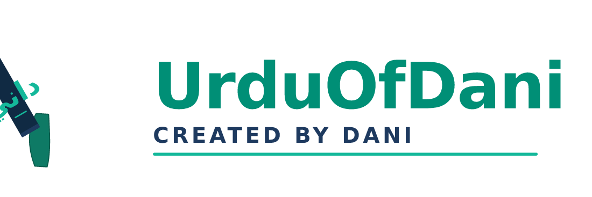

<div align="center">



**Modern Urdu word-processor & desktop publishing. Like InPage, but built for today.**

*Created by **Muhammad Danish [Dani] · DaniLabs***

[Live preview](https://5173-ce10610a.e2b.app) · [Releases](https://github.com/forest1fire/urduofdani/releases) · [Issues](https://github.com/forest1fire/urduofdani/issues)

</div>

---

UrduOfDani is a desktop publishing application for Urdu, Arabic and other
right-to-left languages. The workflow is modelled on InPage, but the
stack is modern: React + Vite for the UI, Electron for the desktop
wrapper, a real Urdu dictionary engine for spell-check, and a plugin
system that runs fully offline.

## Quick start (development)

```bash
npm install
npm run dev:web     # UI on http://localhost:5173
```

## Quick start (desktop — Windows / macOS / Linux)

```bash
npm run dev         # launches Electron with the live Vite dev server
npm run dist:win    # produces an NSIS .exe installer in release/
npm run dist:linux  # produces AppImage + .deb
npm run dist:mac    # produces a .dmg (must run on macOS)
```

## What you get

- **27 fully-implemented screens** — every reference mockup in `design/` is a real, clickable React page.
- **Offline Urdu spell-check** — the vendored `urduofdani-dictionry` engine with 15,848 audited words.
- **Responsive layout** — fluid grids at 560 / 900 / 1200 / 1920 px breakpoints for split-screen and narrow windows.
- **Plugin system** — `.udaniplugin` zip packages with a documented manifest format and three working sample plugins.
- **Auto-built installers** — GitHub Actions builds the Windows `.exe`, Linux AppImage + `.deb` and macOS `.dmg` on every `v*` tag.

## Stack

| Layer    | Choice                          |
|----------|---------------------------------|
| Desktop  | Electron 33                     |
| UI       | React 18 + Vite 5 (vanilla CSS) |
| Packager | electron-builder 25             |
| Spell    | urduofdani-dictionry 3.1.0 (offline) |
| Python   | 3.9+ (used only for the spell-check sidecar in the Electron build) |

## Repository layout

```
.
├── design/                       26 reference mockups + INVENTORY.md
├── archive/                      Old source zip, InPage 2012 reference, README-FIRST
├── docs/
│   ├── DESIGN-SYSTEM.md          Tokens, components, layout patterns
│   ├── GETTING-STARTED.md        User guide
│   └── UDANI-FORMAT.md           The .udani document format (JSON)
├── resources/
│   ├── logo-icon.svg             Brand icon (the emerald pen)
│   ├── logo-wordmark.svg         Brand wordmark ("UrduOfDani" + "Created by Dani")
│   ├── icon.png                  1024×1024 PNG for Electron / Windows / Linux / macOS
│   ├── favicon-16/32.png         Browser tab icons
│   └── apple-touch-icon.png      iOS / PWA icon
├── src/
│   ├── main/index.cjs            Electron main (spawns the spell-check sidecar)
│   ├── preload/preload.cjs       contextBridge: exposes window.udani.spell
│   └── renderer/
│       ├── App.jsx               Shell + routes
│       ├── components/           TopBar, SideNav, CommandPalette, Brand, …
│       ├── pages/                27 fully-built screens
│       ├── styles/               tokens, components, responsive
│       └── lib/                  spell engine + Electron bridge
├── vendor/                       urduofdani-dictionry engine + 15,848-word DB
├── plugins/README.md             .udaniplugin spec
├── samples/                      3 working .udaniplugin packages
├── tests/smoke.test.mjs          12 tests (spell, engine, responsive CSS, App)
├── .github/workflows/release.yml Auto-build Windows / Linux on `v*` tag
├── package.json                  electron-builder config inside
└── CHANGELOG.md
```

## Spell-check

The engine is **bundled** — no downloads, no network. To use it from the CLI:

```bash
python3 vendor/urduofdani_engine.py --db vendor/urdu_database.compact.gz --spell "اردو زبان کی خوبصورتی"
python3 vendor/urduofdani_engine.py --db vendor/urdu_database.compact.gz --suggest خوبصو --limit 5
```

In the UI: open **Review → Spelling**. The page live-checks the document using
the same engine (via Electron IPC) or the bundled JS fallback (in the web preview).

## Auto-`.exe` release system

The `.github/workflows/release.yml` workflow produces installers on every `v*` tag:

| Trigger           | Result                              |
|-------------------|-------------------------------------|
| `git tag v1.0.0 && git push --tags` | Windows .exe + Linux AppImage + .deb built and uploaded as release artifacts |
| Manual `workflow_dispatch`         | Same, without a tag                 |

To cut a release:

```bash
git tag v1.0.0
git push origin v1.0.0
# then: gh release create v1.0.0 release/*.exe release/*.AppImage release/*.deb \
#   --title "UrduOfDani 1.0.0" --notes-file CHANGELOG.md
```

## Credits

- Concept, product spec, design direction: **Muhammad Danish [Dani] · DaniLabs**.
- Dictionry engine: [forest1fire/urduofdani-dictionry](https://github.com/forest1fire/urduofdani-dictionry), MIT.
- Noto Nastaliq Urdu / Noto Naskh Arabic: SIL Open Font License 1.1.

## License

MIT — see `LICENSE`.
